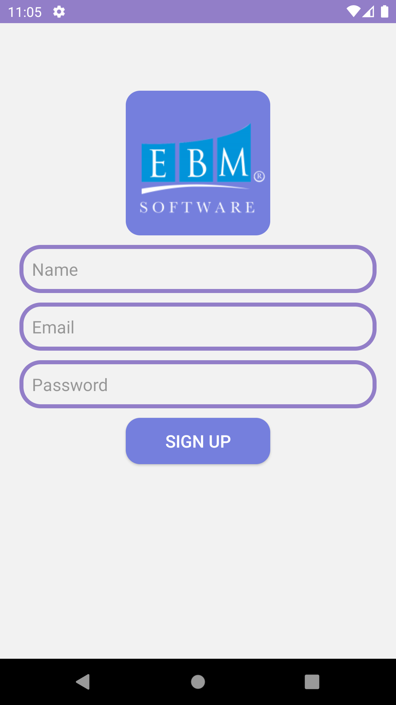
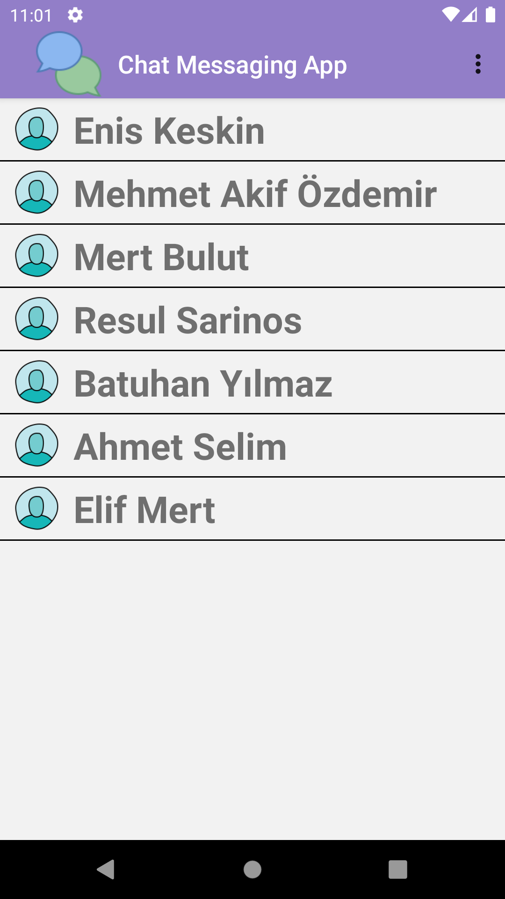
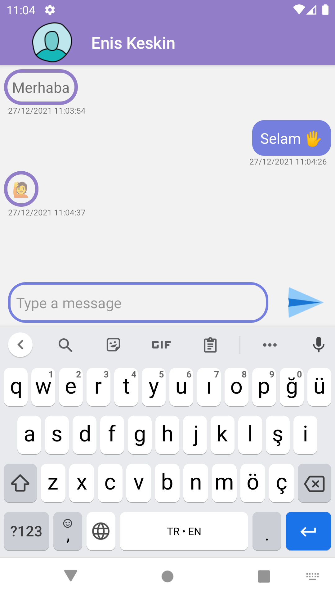
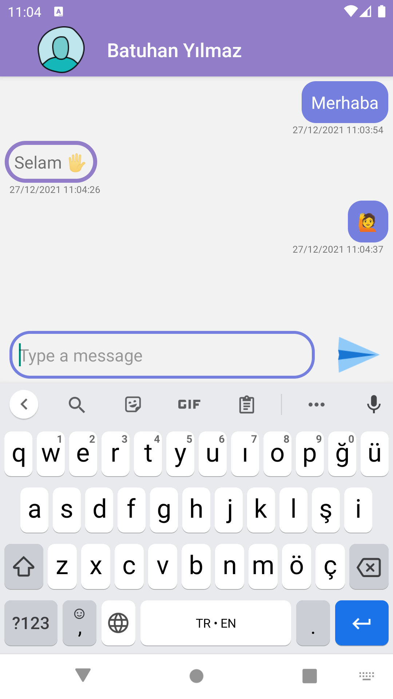
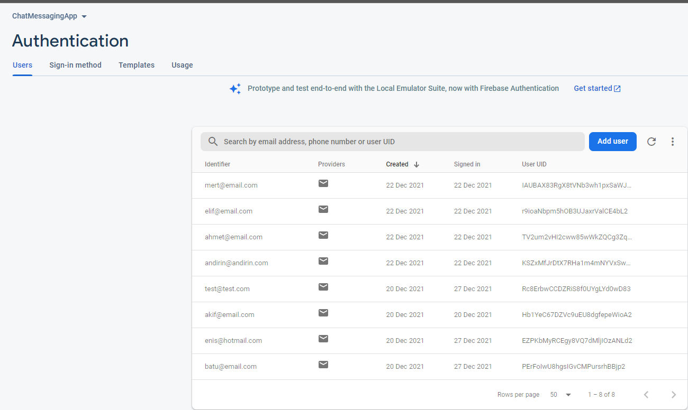
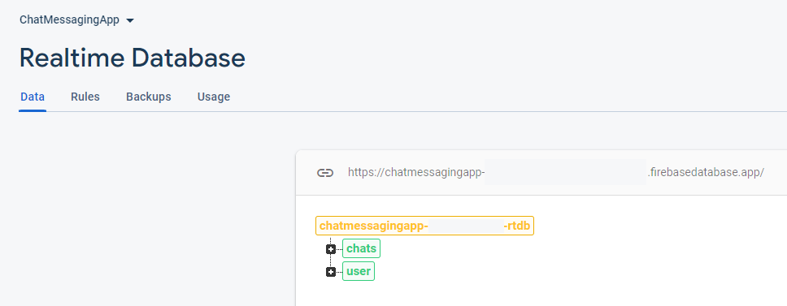
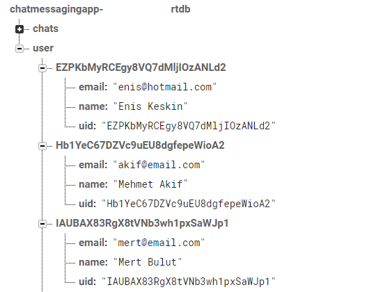

> ANKARA UNIVERSITY
> COMPUTER ENGINEERING <br/>
> Project for: `ANDROID OPERATING SYSTEM FOR MOBILE DEVICES` Course

## Chat Messaging App

The aim of this project is to create a messaging platform that allows users to send
messages online via mobile phones. This application aims to solve the problem of
instant message communication and it can be customized to be used for school
communication like between teachers and parents of students. After signing up to the
system, users will be able to create new messages from the page where all messages
are located, or continue their old chats if they wish. <br/>
We are currently aiming to send text as a message, but we can move forward and add
specific data communication in other formats such as images. We consider setting up 
user registrations and notifications messages using web services. These notifications
occur when a user sends a message to another user.

## Team Members
```sh
* Batuhan YILMAZ   -> github.com/batuhanylmz1421
* Enis Kaan KESKİN -> github.com/enis1998
```
## Tech
- [Kotlin] - **The language**
- [Firebase] - **Web service**

## Screenshots
- Inside App:

--------------------------------

--------------------------------

--------------------------------

--------------------------------

--------------------------------

--------------------------------

--------------------------------

- Firebase:

--------------------------------

--------------------------------

--------------------------------


[Kotlin]: <https://kotlinlang.org/>
[firebase]: <https://firebase.google.com/>

